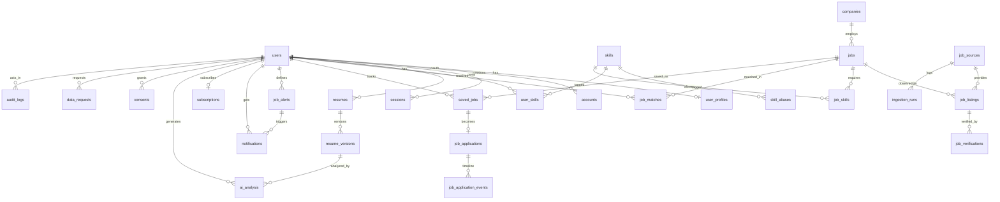

# SkillMatch Jobs — Technical Architecture

| | |
|---|---|
| **Status** | Draft for sign-off — no implementation started |
| **Version** | 1.0 |
| **Date** | 2026-09-19 |
| **Scope** | Full system design, pre-implementation |

---

## 0. How to read this document

Sections 2–6 and 22–23 map to the requested artefacts **A–J**. Sections 7–21 cover the
remaining system artefacts (API, auth, resume parsing, dedup, workers, deployment).
Section 24 lists the handful of decisions still open for sign-off.

Every design choice here is made to satisfy one constraint above all others:

> **Never claim a job is active without evidence. Never guarantee a user is qualified.
> Never fabricate a job, company, salary or apply URL. Always preserve the original source URL.**

---

## 1. Product summary and non-goals

**What it is.** An AI-powered job *discovery* platform. Users upload a resume, confirm the
skills extracted from it, set preferences, and receive jobs aggregated from multiple
legally-permitted sources — ranked by an explainable match score, deduplicated, and
verified for freshness. Users track applications and receive alerts.

**Non-goals (explicit).**

- The platform **does not host applications**. Every job links out to the original source.
- The platform **does not scrape sources without permission**. See §11.
- The platform **does not promise employability**. Match scores are advisory and always
  presented with their component breakdown. See §12.
- The platform is **not** a resume-writing tool that invents experience. See §10.

---

## 2. Recommended architecture (A)

**Pattern: modular monolith with a separate worker process.** Not microservices.

```
┌──────────────────────────────────────────────────────────────────────┐
│                          CLIENT (Browser)                            │
│         Next.js App Router · React 19 · Tailwind · shadcn/ui         │
└───────────────────────────────┬──────────────────────────────────────┘
                                │ HTTPS
┌───────────────────────────────▼──────────────────────────────────────┐
│                    WEB TIER — Next.js (Node runtime)                 │
│  ┌────────────────┐ ┌───────────────┐ ┌──────────────────────────┐   │
│  │ Server Comps   │ │ Route Handlers│ │ Auth.js middleware       │   │
│  │ (RSC)          │ │ /api/*        │ │ RBAC + rate limit        │   │
│  └────────────────┘ └───────┬───────┘ └──────────────────────────┘   │
│                             │ thin controllers only                  │
└─────────────────────────────┼────────────────────────────────────────┘
                              │  in-process imports
┌─────────────────────────────▼────────────────────────────────────────┐
│                      packages/* — CORE DOMAIN                        │
│  auth · profiles · skills · resumes · jobs · matching · alerts ·     │
│  billing  →  services → repositories (Prisma) → domain types (Zod)   │
│                                                                      │
│  cross-cutting: ai/ (provider abstraction) · sources/ (adapters) ·   │
│  queue/ (job producers) · storage/ · mail/ · logging/ · security/    │
└───────┬──────────────────────────────────────────┬───────────────────┘
        │ enqueue (BullMQ)                         │ Prisma
┌───────▼──────────────────────┐    ┌──────────────▼───────────────────┐
│   WORKER TIER (container)    │    │        PostgreSQL 16             │
│  ┌────────────────────────┐  │    │  + pgvector  + pg_trgm           │
│  │ ingest · verify · dedup│  │    │  (jobs, listings, matches,       │
│  │ resume · embed · match │  │    │   users, skills, alerts, audit)  │
│  │ alerts · email · maint │  │    └──────────────────────────────────┘
│  └────────────────────────┘  │    ┌──────────────────────────────────┐
│  BullMQ repeatable schedulers│    │  Redis — queues, rate limit,     │
└───────┬──────────────────────┘    │          response cache          │
        │                           └──────────────────────────────────┘
        ├──► AIProvider (Claude / OpenAI / Mock)
        ├──► JobSourceAdapters (Adzuna, Jooble, Greenhouse, Lever, …)
        ├──► Object Storage (S3 / Azure Blob / MinIO) — resumes
        └──► Email (Resend / SES)
```

### Why this shape

| Decision | Rationale |
|---|---|
| Modular monolith, not microservices | One team, one deploy pipeline. Domain boundaries live in `packages/*` so any module can be extracted into a service later without a rewrite. |
| Separate worker process from day one | Ingestion, embeddings and LLM calls must never run inside an HTTP request. Same codebase, different entrypoint: `apps/web` vs `apps/worker`. |
| Monorepo (pnpm workspaces + Turborepo) | Web and worker share `packages/core` with zero duplication; adapters and AI providers are independently testable and independently swappable. |
| Postgres for relational + vector + trigram | One datastore for jobs, matches, embeddings and fuzzy dedup. No separate vector DB to operate until scale demands it. |
| BullMQ repeatable jobs as the only scheduler | Single source of truth for cron; every run is visible, retryable and inspectable in the admin dashboard. No hidden system crontab. |
| Everything queueable is idempotent | Every job carries a deterministic idempotency key, so retries and duplicate enqueues are safe. |

---

## 3. Technology stack (B)

| Layer | Choice | Notes |
|---|---|---|
| Frontend | **Next.js 15** (App Router), React 19, TypeScript 5 strict | RSC-first; client components only where interactive |
| Styling | **Tailwind CSS v4**, **shadcn/ui**, Radix primitives, Lucide | Design tokens as CSS variables → light/dark for free |
| Forms / validation | React Hook Form + **Zod** | Zod schemas shared client and server — one source of truth |
| Backend | **Next.js Route Handlers** (Node runtime) + `packages/core` services | Thin controllers → services → repositories |
| ORM / DB | **Prisma** + **PostgreSQL 16** | Migrations, typed client, seed scripts |
| Vector | **pgvector** (HNSW) + **pg_trgm** | Embeddings and fuzzy text search in the same DB |
| Auth | **Auth.js v5** (`@auth/prisma-adapter`) | Email/password + Google + LinkedIn, email verification, password reset. Self-hosted, no vendor lock |
| Password hashing | **argon2id** | Memory-hard; params tuned per environment |
| Queues | **BullMQ** + Redis | Queues, repeatable jobs, per-queue rate limiting |
| Storage | **S3-compatible** behind a `StorageProvider` interface | AWS S3 / Azure Blob / MinIO (local) |
| AI | **Provider abstraction** — `ClaudeProvider`, `OpenAIProvider`, `MockProvider` | Per-task model config + fallback chain |
| Embeddings | Provider-agnostic; default `text-embedding-3-small` (1536-d) or `voyage-3` | Stored with `embedding_model` so re-embedding is a migration, not a rewrite |
| Email | **Resend** + React Email templates | SES / SendGrid swappable behind a `MailProvider` |
| Logging | **pino** structured JSON | + Sentry for errors, OpenTelemetry later |
| Testing | **Vitest** (unit, integration), **Testcontainers** (DB), **Playwright** (e2e), **MockProvider** (deterministic AI) | The AI is never called in CI |
| Deployment | **Docker** multi-stage. Web → Vercel/Fly/ECS. Worker → Fly/Railway/ECS Fargate. Postgres → Neon/Supabase/RDS. Redis → Upstash/ElastiCache | |
| Payments (ready, not built) | Stripe behind a `BillingProvider` interface | Entitlement checks wired from Phase 1 |

### Local development on this machine

Docker is not currently installed. Options, in order of preference:

1. **Docker Desktop** — `docker compose up` provides Postgres + pgvector, Redis, MinIO,
   MailHog, worker and web. Reproducible and matches production. *Recommended.*
2. **Zero-install path** — Neon (serverless Postgres with `pgvector` preinstalled) plus
   Upstash Redis; run only `next dev` and `tsx worker` locally. Works with the current
   toolchain immediately.
3. Native Postgres + pgvector on Windows — most friction, not recommended.

---

## 4. Database ER diagram (C)



### Key modelling decision — `jobs` vs `job_listings`

- **`jobs`** = the canonical real-world opening. One row per actual job. Holds deduplicated,
  normalized content and the aggregated `active_status`.
- **`job_listings`** = one row per *observed posting on one source*. Unique on
  `(source_id, source_job_id)`. Holds that source's own title, location, original URL and
  raw payload.

This split is what makes deduplication and verification clean:

- "Found on 3 sources" is `COUNT(job_listings WHERE job_id = …)`.
- Each source's original link and its independent verification state are preserved.
- The original source URL is never lost, rewritten or replaced.

---

## 5. Project folder structure (D)

```
skillmatch-jobs/
├── apps/
│   ├── web/                              # Next.js — UI + API route handlers
│   │   ├── src/app/
│   │   │   ├── (marketing)/              # public: landing, pricing, legal
│   │   │   ├── (auth)/                   # sign-in, sign-up, verify, reset
│   │   │   ├── (app)/                    # authed shell with sidebar nav
│   │   │   │   ├── dashboard/
│   │   │   │   ├── jobs/[id]/
│   │   │   │   ├── saved/                # Kanban tracker
│   │   │   │   ├── alerts/
│   │   │   │   ├── resume/
│   │   │   │   ├── skills/
│   │   │   │   ├── profile/
│   │   │   │   └── settings/
│   │   │   ├── (admin)/admin/
│   │   │   └── api/
│   │   │       ├── auth/[...nextauth]/
│   │   │       ├── resumes/  profile/  skills/  jobs/
│   │   │       ├── alerts/   recommendations/
│   │   │       └── admin/
│   │   ├── src/components/               # ui/ (shadcn) · jobs/ · resume/ · dashboard/ · admin/
│   │   ├── src/lib/                      # api-client, session helpers, hooks
│   │   └── middleware.ts                 # auth + RBAC + CSP + rate limit
│   └── worker/                           # BullMQ consumers + repeatable schedulers
│       └── src/{index.ts, queues/, processors/, schedulers/}
├── packages/
│   ├── core/                             # THE domain — imports nothing from apps
│   │   └── src/
│   │       ├── domain/                   # entities + Zod schemas (single source of truth)
│   │       ├── services/                 # business logic (auth, resume, job, matching, alert)
│   │       ├── repositories/             # Prisma data access
│   │       ├── config/                   # env parsing + validation (Zod)
│   │       └── lib/                      # errors, result, pagination, crypto, redaction
│   ├── ai/                               # AIProvider interface + implementations
│   │   └── src/{provider.ts, claude/, openai/, mock/, prompts/, schemas/, router.ts}
│   ├── sources/                          # job-source adapter framework
│   │   └── src/{adapter.ts, registry.ts, normalize.ts, http/, adapters/*}
│   ├── matching/                         # 3-layer engine, scorers, explainability
│   ├── taxonomy/                         # skill normalization + canonical taxonomy
│   ├── queue/                            # queue names, payload types, producers
│   ├── db/                               # Prisma schema, migrations, seed
│   ├── storage/                          # StorageProvider (S3 / Blob / MinIO)
│   ├── mail/                             # MailProvider + React Email templates
│   └── ui/                               # shared design system primitives
├── docker/{Dockerfile.web, Dockerfile.worker, docker-compose.yml}
├── e2e/                                  # Playwright specs
├── docs/                                 # architecture, ADRs, runbooks
├── turbo.json   pnpm-workspace.yaml   .env.example   CLAUDE.md
```

### Dependency rule (enforced by ESLint boundaries)

```
apps/*  →  packages/*  →  packages/core
```

`core` imports nothing from `apps`. `sources` and `ai` depend only on `core` types. This rule
is what makes adapters and AI providers genuinely pluggable rather than nominally pluggable.

---

## 6. Core database schema (E)

Prisma-flavoured, abbreviated to the load-bearing columns. Every table carries
`created_at` / `updated_at`.

```prisma
model User {
  id            String     @id @default(cuid())
  email         String     @unique
  emailVerified DateTime?
  passwordHash  String?                        // null for OAuth-only users
  name          String?
  image         String?
  role          Role       @default(USER)      // USER | ADMIN
  status        UserStatus @default(ACTIVE)    // ACTIVE | SUSPENDED | PENDING_DELETION
  createdAt     DateTime   @default(now())
  updatedAt     DateTime   @updatedAt
  deletedAt     DateTime?
  @@index([status, createdAt])
}

model UserProfile {
  userId             String  @id
  headline           String?
  yearsExperience    Int?
  currentTitle       String?
  currentCompany     String?
  phone              String?                   // encrypted at the application layer
  city               String?
  region             String?
  country            String?
  preferredTitles    String[]
  preferredLocations String[]
  willingToRelocate  Boolean @default(false)
  remotePreference   RemoteType[]
  employmentTypes    EmploymentType[]
  noticePeriodDays   Int?
  expectedSalaryMin  Int?
  expectedSalaryMax  Int?
  salaryCurrency     String? @db.VarChar(3)
  educationLevel     EducationLevel?
  languages          String[]
  embedding          Unsupported("vector(1536)")?
  embeddingModel     String?
  updatedAt          DateTime @updatedAt
}

model Resume {
  id               String       @id @default(cuid())
  userId           String
  title            String
  isPrimary        Boolean      @default(false)
  status           ResumeStatus @default(UPLOADED)  // UPLOADED|PROCESSING|PARSED|FAILED
  currentVersionId String?
  deletedAt        DateTime?
  @@index([userId, isPrimary])
}

model ResumeVersion {
  id              String  @id @default(cuid())
  resumeId        String
  version         Int
  storageKey      String                       // private bucket, never public
  fileName        String
  mimeType        String
  sizeBytes       Int
  checksumSha256  String                       // dedupes identical re-uploads
  pageCount       Int?
  rawText         String? @db.Text
  parsedJson      Json?
  parseConfidence Float?
  parserVersion   String?                      // extractor + model + prompt version
  embedding       Unsupported("vector(1536)")?
  @@unique([resumeId, version])
}

model Skill {
  id            String      @id @default(cuid())
  slug          String      @unique             // "microsoft-azure"
  canonicalName String                          // "Microsoft Azure"
  category      String?                         // cloud | language | tool | domain
  status        SkillStatus @default(ACTIVE)    // ACTIVE | PENDING_REVIEW | DEPRECATED
  popularity    Int         @default(0)
  embedding     Unsupported("vector(1536)")?
  @@index([status, popularity])
}

model SkillAlias {
  id        String @id @default(cuid())
  skillId   String
  alias     String
  aliasSlug String @unique                      // normalization lookup key
  @@index([skillId])
}

model UserSkill {
  id          String       @id @default(cuid())
  userId      String
  skillId     String
  proficiency Proficiency?                    // BEGINNER .. EXPERT
  years       Float?
  source      SkillSource  @default(MANUAL)   // MANUAL | RESUME_AI | RESUME_CONFIRMED
  confidence  Float?
  @@unique([userId, skillId])
  @@index([skillId])
}

model Company {
  id             String  @id @default(cuid())
  name           String
  normalizedName String  @unique              // fuzzy dedup key
  domain         String?
  logoUrl        String?
  @@index([normalizedName])
}

model JobSource {
  id                   String     @id @default(cuid())
  key                  String     @unique     // "adzuna", "greenhouse"
  displayName          String
  kind                 SourceKind             // API | PUBLIC_FEED | EMPLOYER_API | PARTNER | MANUAL
  adapterClass         String
  enabled              Boolean    @default(false)  // off until credentials + compliance confirmed
  trustScore           Int        @default(50)     // drives canonical pick + verify cadence
  pollIntervalMinutes  Int        @default(60)
  rateLimitPerMin      Int        @default(30)
  attributionRequired  Boolean    @default(false)
  configEncrypted      Bytes?                     // API keys — AES-256-GCM, never plaintext
  lastSuccessAt        DateTime?
  consecutiveFailures  Int        @default(0)
}

model Job {
  id                      String          @id @default(cuid())
  title                   String
  companyId               String
  locationRaw             String?
  city                    String?
  region                  String?
  country                 String?
  remoteType              RemoteType?     // REMOTE | HYBRID | ONSITE | UNKNOWN
  employmentType          EmploymentType?
  salaryMin               Int?
  salaryMax               Int?
  salaryCurrency          String?         @db.VarChar(3)
  salaryPeriod            SalaryPeriod?
  salaryIsEstimated       Boolean         @default(false)  // true when only a source estimate exists
  description             String          @db.Text
  requirements            String?         @db.Text
  experienceMinYears      Int?
  experienceMaxYears      Int?
  educationLevel          EducationLevel?
  postedAt                DateTime?
  expiresAt               DateTime?
  firstSeenAt             DateTime        @default(now())
  lastSeenAt              DateTime        @default(now())
  lastVerifiedAt          DateTime?
  activeStatus            JobActiveStatus @default(UNKNOWN) // ACTIVE|STALE|EXPIRED|GONE|UNKNOWN
  verificationConfidence  Int             @default(0)
  dedupKey                String          // normalized title|company|location
  contentHash             String          // detects material edits
  isDemo                  Boolean         @default(false)  // seed data — never shown as a real posting
  sourceCount             Int             @default(1)
  primaryListingId        String?
  embedding               Unsupported("vector(1536)")?
  embeddingModel          String?
  @@index([activeStatus, postedAt(sort: Desc)])
  @@index([companyId])
  @@index([dedupKey])
  @@index([contentHash])
  @@index([city, country])
  @@index([remoteType])
}

model JobListing {
  id                 String             @id @default(cuid())
  jobId              String
  sourceId           String
  sourceJobId        String
  jobUrl             String             // ORIGINAL url, preserved verbatim
  applyUrl           String?
  rawPayload         Json?
  titleRaw           String
  companyNameRaw     String
  locationRaw        String?
  urlHash            String             // canonicalized-url hash
  fingerprint        String             // per-observation dedup fingerprint
  firstSeenAt        DateTime           @default(now())
  lastSeenAt         DateTime           @default(now())
  lastVerifiedAt     DateTime?
  verificationStatus VerificationStatus @default(UNVERIFIED)
  httpStatus         Int?
  isPrimary          Boolean            @default(false)
  @@unique([sourceId, sourceJobId])
  @@unique([sourceId, urlHash])
  @@index([jobId])
  @@index([fingerprint])
}

model JobSkill {
  id          String          @id @default(cuid())
  jobId       String
  skillId     String
  requirement Requirement     @default(REQUIRED)  // REQUIRED | PREFERRED
  weight      Float           @default(1.0)
  confidence  Float           @default(1.0)
  source      DetectionSource                     // RULE | SEMANTIC | LLM
  evidence    String?                             // the JD span that justified it
  @@unique([jobId, skillId])
  @@index([skillId])
}

model JobMatch {
  id              String   @id @default(cuid())
  userId          String
  jobId           String
  matchScore      Int                          // 0-100 display value
  skillScore      Float
  semanticScore   Float
  titleScore      Float
  experienceScore Float
  locationScore   Float
  employmentScore Float
  educationScore  Float
  llmAdjustment   Int      @default(0)         // clamped to +/-10
  matchedSkills   Json                         // [{ skillId, name, weight, via }]
  missingSkills   Json
  reason          String?  @db.Text
  model           String?
  promptVersion   String?
  inputHash       String                       // resumeVersionId + job.contentHash + promptVersion
  computedAt      DateTime @default(now())
  isStale         Boolean  @default(false)
  @@unique([userId, jobId])
  @@index([userId, matchScore(sort: Desc)])
  @@index([jobId])
}

model SavedJob {
  id        String        @id @default(cuid())
  userId    String
  jobId     String
  status    TrackerStatus @default(INTERESTED) // INTERESTED|APPLIED|INTERVIEW|REJECTED|OFFER|CLOSED
  notes     String?       @db.Text
  sortOrder Int           @default(0)
  savedAt   DateTime      @default(now())
  @@unique([userId, jobId])
  @@index([userId, status])
}

model JobApplication {
  id              String    @id @default(cuid())
  userId          String
  jobId           String
  resumeVersionId String?
  appliedAt       DateTime?
  outcome         String?
  @@unique([userId, jobId])
}

model JobApplicationEvent {
  id            String   @id @default(cuid())
  applicationId String
  type          String
  note          String?
  occurredAt    DateTime
}

model JobAlert {
  id              String         @id @default(cuid())
  userId          String
  name            String
  keywords        String?
  titles          String[]
  skillIds        String[]
  locations       String[]
  remoteTypes     RemoteType[]
  employmentTypes EmploymentType[]
  experienceMin   Int?
  experienceMax   Int?
  salaryMin       Int?
  frequency       AlertFrequency @default(DAILY)   // INSTANT | DAILY | WEEKLY
  isActive        Boolean        @default(true)
  lastRunAt       DateTime?
  @@index([userId, isActive])
}

model Notification {
  id      String    @id @default(cuid())
  userId  String
  type    String
  title   String
  body    String?
  payload Json?
  readAt  DateTime?
  @@index([userId, readAt])
}

model Subscription {
  id                   String    @id @default(cuid())
  userId               String    @unique
  plan                 Plan      @default(FREE)    // FREE | PREMIUM
  status               String    @default("active")
  stripeCustomerId     String?   @unique
  stripeSubscriptionId String?   @unique
  currentPeriodEnd     DateTime?
  entitlements         Json?                       // { maxAlerts, aiAnalysesPerMonth, ... }
}

model UsageCounter {
  id      String @id @default(cuid())
  userId  String
  period  String                                   // "2026-09"
  feature String
  count   Int    @default(0)
  @@unique([userId, period, feature])
}

model AiAnalysis {
  id            String   @id @default(cuid())
  userId        String
  kind          String                             // parse | match | resume_improvement
  provider      String
  model         String
  promptVersion String
  inputHash     String
  outputJson    Json?
  tokensIn      Int      @default(0)
  tokensOut     Int      @default(0)
  costUsd       Decimal? @db.Decimal(10, 6)
  latencyMs     Int?
  status        String                             // ok | error | timeout | rate_limited
  error         String?
  @@index([userId, createdAt])
  @@index([kind, createdAt])
}

model JobVerification {
  id         String   @id @default(cuid())
  listingId  String
  checkedAt  DateTime @default(now())
  method     String
  result     String                                // ok | gone | http_error | unknown
  httpStatus Int?
  evidence   Json?
  @@index([listingId, checkedAt])
}

model IngestionRun {
  id           String    @id @default(cuid())
  sourceId     String
  status       String
  itemsFetched Int       @default(0)
  itemsNew     Int       @default(0)
  itemsUpdated Int       @default(0)
  itemsFailed  Int       @default(0)
  cursor       String?
  error        String?
  startedAt    DateTime  @default(now())
  finishedAt   DateTime?
  @@index([sourceId, startedAt])
}

model AuditLog {
  id          String   @id @default(cuid())
  actorUserId String?
  actorIp     String?
  action      String
  entityType  String
  entityId    String?
  before      Json?
  after       Json?
  createdAt   DateTime @default(now())
  @@index([actorUserId, createdAt])
  @@index([entityType, entityId])
}

model Consent {
  id        String    @id @default(cuid())
  userId    String
  purpose   String
  version   String
  grantedAt DateTime  @default(now())
  revokedAt DateTime?
  ip        String?
  @@unique([userId, purpose, version])
}

model DataRequest {
  id          String    @id @default(cuid())
  userId      String
  type        String                                // export | deletion
  status      String
  artifactKey String?
  requestedAt DateTime  @default(now())
  completedAt DateTime?
}
```

### Enumerations

```
Role             USER | ADMIN
RemoteType       REMOTE | HYBRID | ONSITE | UNKNOWN
EmploymentType   FULL_TIME | PART_TIME | CONTRACT | INTERNSHIP | TEMPORARY | FREELANCE
EducationLevel   HIGH_SCHOOL | ASSOCIATE | BACHELOR | MASTER | DOCTORATE | OTHER
JobActiveStatus  ACTIVE | STALE | EXPIRED | GONE | UNKNOWN
TrackerStatus    INTERESTED | APPLIED | INTERVIEW | REJECTED | OFFER | CLOSED
SkillStatus      ACTIVE | PENDING_REVIEW | DEPRECATED
SkillSource      MANUAL | RESUME_AI | RESUME_CONFIRMED
DetectionSource  RULE | SEMANTIC | LLM
SourceKind       API | PUBLIC_FEED | EMPLOYER_API | PARTNER | MANUAL
AlertFrequency   INSTANT | DAILY | WEEKLY
Plan             FREE | PREMIUM
```

### Critical indexes

| Index | Serves |
|---|---|
| `jobs(activeStatus, postedAt DESC)` | default search + recommendation feed |
| `jobs(dedupKey)` | exact-fingerprint dedup lookup |
| `jobs(companyId)`, `jobs(city, country)`, `jobs(remoteType)` | search filters |
| GIN trigram on `jobs.title`, `companies.normalizedName` | fuzzy search + dedup candidate generation |
| `job_skills(skillId)` | "jobs requiring skill X" |
| `job_matches(userId, matchScore DESC)` | dashboard ordering |
| `job_listings(sourceId, sourceJobId)` unique | ingestion idempotency |
| `job_listings(sourceId, urlHash)` unique | URL-level dedup |
| `user_skills(userId, skillId)` unique | profile integrity |
| HNSW (`vector_cosine_ops`) on `jobs.embedding`, `user_profiles.embedding`, `skills.embedding` | semantic layers |

---

## 7. API specification

### Conventions

- All endpoints are JSON over HTTPS under `/api`. Authenticated endpoints require a valid
  session cookie; `401` otherwise, `403` when the role check fails.
- **Success envelope:** the payload directly, or `{ "data": [...], "page": { "nextCursor": "...", "hasMore": true } }` for lists.
- **Cursor pagination** everywhere lists are unbounded (jobs, matches, notifications). Offset
  pagination is used only for small admin tables.
- **Error envelope:**

```json
{
  "error": {
    "code": "RESUME_INVALID_FILE",
    "message": "That file type isn't supported. Please upload a PDF, DOC or DOCX.",
    "details": { "mimeType": "image/png" },
    "correlationId": "01J8Z..."
  }
}
```

`message` is always user-safe. Technical detail goes to logs and Sentry under `correlationId`.

### Authentication

| Method | Path | Auth | Purpose |
|---|---|---|---|
| `POST` | `/api/auth/register` | public | Create account, send verification email |
| `POST` | `/api/auth/verify-email` | token | Confirm email address |
| `POST` | `/api/auth/forgot-password` | public | Start reset flow (always returns 200) |
| `POST` | `/api/auth/reset-password` | token | Complete reset |
| `*` | `/api/auth/[...nextauth]` | — | Auth.js: sign-in, callback, session, OAuth |
| `POST` | `/api/auth/consent` | user | Record AI-processing consent |

### Resume

| Method | Path | Auth | Purpose |
|---|---|---|---|
| `POST` | `/api/resumes/upload` | user | Multipart upload → validates, scans, stores, enqueues parse |
| `GET` | `/api/resumes` | user | List the user's resumes |
| `GET` | `/api/resumes/:id` | owner | Metadata + parse status + parsed JSON |
| `GET` | `/api/resumes/:id/versions` | owner | Version history |
| `PATCH` | `/api/resumes/:id/parsed` | owner | **Confirm/correct extracted fields** before saving |
| `POST` | `/api/resumes/:id/primary` | owner | Mark primary |
| `DELETE` | `/api/resumes/:id` | owner | Soft-delete + purge file and derived AI artifacts |
| `GET` | `/api/resumes/:id/download` | owner | Short-TTL signed URL |

### Profile & skills

| Method | Path | Auth | Purpose |
|---|---|---|---|
| `GET` | `/api/profile` | user | Full profile |
| `PUT` | `/api/profile` | user | Update profile (partial) |
| `GET` | `/api/skills` | user | Search the skill taxonomy (`?q=`) |
| `POST` | `/api/profile/skills` | user | Add skills `{ skillId | rawText }[]` — unknown names go to review |
| `DELETE` | `/api/profile/skills/:id` | owner | Remove a skill |

### Jobs

| Method | Path | Auth | Purpose |
|---|---|---|---|
| `GET` | `/api/jobs` | optional | Search + filter + sort + cursor paginate |
| `GET` | `/api/jobs/:id` | optional | Job detail incl. all listings ("found on N sources") |
| `GET` | `/api/jobs/:id/similar` | optional | Semantic neighbours |
| `POST` | `/api/jobs/:id/save` | user | Save / bookmark |
| `DELETE` | `/api/jobs/:id/save` | user | Unsave |
| `PATCH` | `/api/jobs/:id/save` | user | Update tracker status / notes |

`GET /api/jobs` query params: `q`, `title`, `skills`, `location`, `remoteType`, `employmentType`,
`experienceMin`, `experienceMax`, `salaryMin`, `postedWithin`, `source`, `company`, `sort`,
`cursor`, `limit`.

`sort` ∈ `best_match | newest | salary | relevance`. `best_match` requires an authenticated
session (it reads precomputed `job_matches`); anonymous users get `newest`.

### Matching & recommendations

| Method | Path | Auth | Purpose |
|---|---|---|---|
| `GET` | `/api/recommendations` | user | Precomputed ranked matches, cursor paginated |
| `POST` | `/api/jobs/:id/match` | user | On-demand detailed comparison (queued if stale) |
| `GET` | `/api/jobs/:id/match` | user | Cached match + full component breakdown |

### Saved jobs & tracker

| Method | Path | Auth | Purpose |
|---|---|---|---|
| `GET` | `/api/saved-jobs` | user | Tracker board, grouped by status |
| `POST` | `/api/saved-jobs/:id/events` | user | Append a timeline event |
| `GET` | `/api/applications` | user | Application records |
| `POST` | `/api/applications` | user | Record an application |

### Alerts & notifications

| Method | Path | Auth | Purpose |
|---|---|---|---|
| `GET` | `/api/alerts` | user | List |
| `POST` | `/api/alerts` | user | Create (entitlement-checked) |
| `PUT` | `/api/alerts/:id` | owner | Update |
| `DELETE` | `/api/alerts/:id` | owner | Delete |
| `POST` | `/api/alerts/:id/test` | owner | Send a preview email to self |
| `GET` | `/api/notifications` | user | Inbox |
| `POST` | `/api/notifications/read` | user | Mark read |

### Admin

| Method | Path | Auth | Purpose |
|---|---|---|---|
| `GET` | `/api/admin/statistics` | admin | Users, jobs, matches, AI usage, error counts |
| `GET` | `/api/admin/job-sources` | admin | Sources + health + compliance metadata |
| `PATCH` | `/api/admin/job-sources/:id` | admin | Enable/disable, configure, rotate credentials |
| `GET` | `/api/admin/ingestion-logs` | admin | Ingestion runs with counters and errors |
| `GET` | `/api/admin/duplicates` | admin | Duplicate/cluster review queue |
| `POST` | `/api/admin/jobs/:id/merge` | admin | Merge jobs manually |
| `POST` | `/api/admin/jobs/:id/split` | admin | Unmerge (records a manual override) |
| `DELETE` | `/api/admin/jobs/:id` | admin | Remove an invalid job |
| `GET` `PATCH` | `/api/admin/skills` | admin | Manage the skill taxonomy + alias review queue |
| `GET` `PATCH` | `/api/admin/ai-providers` | admin | Provider config, model routing, budget ceilings |
| `GET` `PATCH` | `/api/admin/schedules` | admin | Scheduled-job intervals |
| `GET` | `/api/admin/users` | admin | Manage users (suspend, role, delete) |
| `GET` | `/api/admin/audit-logs` | admin | Audit trail |

### Privacy

| Method | Path | Auth | Purpose |
|---|---|---|---|
| `GET` | `/api/privacy/export` | user | Enqueue a data export |
| `POST` | `/api/privacy/delete-account` | user | Request account deletion (confirmed by email) |
| `GET` `POST` | `/api/privacy/consents` | user | Read / grant / revoke consent |

### Health

| Method | Path | Auth | Purpose |
|---|---|---|---|
| `GET` | `/api/health` | public | Liveness |
| `GET` | `/api/health/ready` | internal token | Readiness: DB, Redis, storage, AI provider |

---

## 8. Authentication & authorization architecture

### Providers

| Method | Flow |
|---|---|
| Email + password | argon2id hash. Email verification required before dashboard access. |
| Google | OAuth 2.0 / OIDC via Auth.js |
| LinkedIn | OIDC via Auth.js (optional — requires app review; the UI degrades gracefully if unconfigured) |

### Session strategy

- Auth.js v5 with the Prisma adapter for accounts and verification tokens.
- Session cookie is `httpOnly`, `Secure`, `SameSite=Lax`, with a rotating session token.
- Sessions are revocable server-side (a `sessions` row), so "sign out everywhere" and
  "revoke after password change" actually work.
- On password change or reset, all other sessions for that user are invalidated.

### Account linking

OAuth sign-in with an email that already has a password account **requires a verified email
match** before linking. Otherwise the user is asked to sign in with their existing method
first. This prevents account-takeover-by-email-claim.

### RBAC

Two roles: `USER`, `ADMIN`. Enforcement is layered:

1. `middleware.ts` — coarse route protection and redirects.
2. Route handler — session presence and role.
3. Service layer — **resource ownership** checks (`resume.userId === session.user.id`).

Ownership is never checked only in the UI or only in middleware. Every repository call that
touches user-owned data takes the acting user id and filters on it.

### Permission matrix

| Resource | USER | ADMIN |
|---|---|---|
| Own profile, skills, resumes | full | full |
| Others' profiles | none | metadata only, no resume content |
| Job sources config | none | full |
| Job content | read | read, edit, merge, delete |
| Skills taxonomy | read, propose | full |
| Audit logs | own actions | all |
| AI providers & budgets | none | full |

### Account lifecycle

`PENDING_VERIFICATION` → `ACTIVE` → (`SUSPENDED` \| `PENDING_DELETION`) → purged.
Deletion is soft-first (immediate sign-out and data hiding), then hard-purged by a worker
after the retention window.

---

## 9. AI architecture (F)

### The three matching layers

```
                    ┌──────────────────────────────────────────┐
                    │  LAYER 0 — Deterministic pre-filter      │
                    │  SQL only, no AI. Cheap candidate gen:   │
                    │  active jobs ∧ (skill overlap ∨ FTS ∨    │
                    │   pgvector ANN top-200) → ≤500 candidates│
                    └──────────────────┬───────────────────────┘
                                       ▼
        ┌──────────────────────────────────────────────────────────┐
        │  LAYER 1 — Rule-based                                    │
        │  Normalized skill-ID intersection                        │
        │  required w=1.0 · preferred w=0.55                       │
        │  + title similarity (token set ratio)                    │
        │  + experience band overlap                               │
        │  + location / remote / employment / education fit        │
        │  → fully explainable, zero cost, runs for every user     │
        └──────────────────┬───────────────────────────────────────┘
                           ▼
        ┌──────────────────────────────────────────────────────────┐
        │  LAYER 2 — Semantic (pgvector)                           │
        │  For each UNMATCHED job skill, cosine-compare its        │
        │  embedding against the user's skill embeddings.          │
        │  sim ≥ 0.82 → "related match", credit 0.60               │
        │  0.72–0.82 → weak signal, no credit, shown as "close"    │
        │  ADF ↔ Azure Data Factory · React ↔ ReactJS              │
        └──────────────────┬───────────────────────────────────────┘
                           ▼
        ┌──────────────────────────────────────────────────────────┐
        │  LAYER 3 — LLM (top-K only, K≈30, async, cached)         │
        │  Returns STRICT JSON validated against a Zod schema      │
        │  → nuance, seniority fit, domain fit, one-line reason    │
        │  → may adjust the score by at most ±10                    │
        └──────────────────────────────────────────────────────────┘
```

### Score composition

Weights live in one versioned config object, not scattered through the code.

| Component | Weight | Method |
|---|---|---|
| Skill match — required | 30% | weighted skill intersection |
| Skill match — preferred | 15% | weighted, lower credit |
| Skill semantic relatedness | 15% | cosine ≥ threshold, partial credit |
| Job title similarity | 15% | normalized token-set ratio vs preferred titles |
| Experience | 10% | band overlap; over-qualification mildly penalized |
| Location | 8% | city/region match or remote acceptance |
| Employment type | 4% | exact match |
| Education / certification | 3% | required vs held; a missing *required* credential caps the score |

```
base  = Σ (weight_i × score_i) × 100
final = clamp(base + clamp(llmAdjustment, -10, +10), 0, 100)
```

Every component is persisted on `job_matches`, so the UI can always show *why* a score is
what it is. If Layer 3 fails or times out, the deterministic score stands alone — the system
degrades gracefully and never blocks on the LLM.

### LLM contract (structured output, strict)

```json
{
  "match_score": 91,
  "matched_skills": [{ "name": "webMethods", "weight": 1.0, "via": "exact" }],
  "missing_skills": [{ "name": "Kubernetes", "weight": 0.55, "via": "exact" }],
  "experience_match": true,
  "location_match": true,
  "title_match": true,
  "reason": "Strong match because the role requires webMethods, API Gateway, Azure and REST API, all present in your profile."
}
```

Parsed with a Zod schema. Anything that fails validation is discarded and the deterministic
score is used. The model may **not** invent skills, employers, dates or credentials — the
prompt requires every listed skill to be traceable to the supplied job text.

### Cost and performance control

- **Never computed in a request.** Matches are precomputed by the `matching` worker and read
  from `job_matches`.
- **Incremental only.** Work is *newly ingested jobs × interested users*, not the full cross-product.
- **`inputHash`** = `hash(resumeVersionId + job.contentHash + promptVersion)`. A cache hit
  skips the call entirely.
- **Batch embeddings** at 100 texts per call; nightly backfill only for changed rows.
- **Budget guards.** Per-user/day and global/day token ceilings in the AI router. Exceeding a
  ceiling pauses Layer 3 and serves deterministic scores — never a hard failure.
- **Staleness.** Editing a resume marks that user's matches `is_stale`; editing a job body
  bumps `contentHash` and flags the job side.

### Provider abstraction

```ts
interface AIProvider {
  readonly id: 'claude' | 'openai' | 'mock'
  parseResume(text: string, ctx: { redactionMap?: RedactionMap }): Promise<ParsedResume>
  extractSkills(text: string): Promise<ExtractedSkill[]>
  analyzeJob(job: JobForAnalysis): Promise<JobAnalysis>
  matchResumeToJob(input: MatchInput): Promise<MatchAnalysis>
  generateResumeSuggestions(input: ResumeReviewInput): Promise<ResumeSuggestion[]>
  embed(texts: string[]): Promise<number[][]>
}
```

An `AIRouter` selects a provider **per task** from configuration, with a fallback chain,
per-call timeout, exponential-backoff retries on 429/5xx, a circuit breaker per provider, and
full accounting into `ai_analysis` (tokens, cost, latency, status). `MockProvider` returns
deterministic fixtures so CI never touches a network AI. Adding a provider is one new folder
and zero core changes.

---

## 10. Resume parsing architecture

### Pipeline

```
Upload (PDF/DOC/DOCX)
  → validate: extension + magic bytes + size ≤ 5 MB + page count cap
  → malware scan (MalwareScanner interface: no-op in dev, ClamAV/cloud in prod)
  → store in private bucket, SSE enabled, key = sha256(userId/content) + uuid
  → enqueue resume-processing
       → text extraction
            PDF   : pdfjs / pdf-parse
            DOCX  : mammoth
            DOC   : antiword or textract (legacy binary format)
       → scanned-PDF detection (extracted chars < threshold per page)
            → OCR fallback (Tesseract), flagged to the user as lower confidence
       → section segmentation (regex + heuristic heading detection:
            Summary · Experience · Education · Skills · Certifications · Projects)
       → PII extraction LOCALLY (regex): name, email, phone, address, profile URLs
            → replace with placeholders, keep a local redaction map
       → LLM structured extraction on REDACTED text, strict JSON schema
            → rehydrate placeholders locally
       → skill normalization against the taxonomy
       → per-field confidence scoring + source-span offsets
  → store resume_version (immutable) with parsed_json + parse_confidence
  → present CONFIRMATION UI: every field editable, low-confidence fields highlighted
  → on user confirm → write user_profile + user_skills (source = RESUME_CONFIRMED)
  → bump profile embedding → mark that user's job_matches stale
```

### Extracted fields

Name · email · phone · location · skills · job titles · companies · total years of experience ·
per-role date ranges · education · certifications · technologies · domains · languages.

### The confirmation step is mandatory

Nothing extracted by AI is written to the profile without explicit user confirmation. The UI
shows every field with its confidence, lets the user correct it, and highlights the resume
span each value came from so the user can verify the extraction rather than trust it.

### Skill normalization

```
raw string
  → trim, NFKD unicode normalize, lowercase, collapse whitespace
  → strip punctuation and version suffixes (".js", "v2", "2019")
  → 1. exact slug match          "microsoft-azure"        conf 1.00
  → 2. alias table match         "ms azure" → skill_id     conf 0.98
  → 3. fuzzy match (trigram + Jaro-Winkler, ≥ 0.90)        conf 0.85
  → 4. embedding kNN over skills.embedding (cosine ≥ 0.86) conf 0.75
  → 5. unresolved → create Skill(status = PENDING_REVIEW), surface in the admin queue
```

Every match carries its confidence and the method that produced it, so a wrong normalization
is always traceable and correctable.

**Required test cases** (these are test fixtures, not aspirations):

| Input variants | Must normalize to |
|---|---|
| `MS Azure`, `Azure Cloud`, `Microsoft Azure` | **Microsoft Azure** |
| `ReactJS`, `React.js`, `React` | **React** |
| `Azure Data Factory`, `ADF`, `Microsoft ADF` | **Azure Data Factory** |
| `ADLS`, `Azure Data Lake Storage Gen2` | **Azure Data Lake Storage** |
| `CI/CD`, `CICD`, `Continuous Integration` | **CI/CD** |
| `Postgres`, `PostgreSQL`, `psql` | **PostgreSQL** |

### Resume improvement (§14) — guardrails

Analysis covers: missing in-demand skills for the user's target titles, keyword coverage
against target roles, formatting/parseability issues (ATS compatibility), job-title alignment,
and vague achievement statements.

It **never** invents experience, employers, dates, metrics or credentials. Suggestions are
phrased as prompts ("this role family commonly lists Terraform; you have not listed it — add
it only if you have used it"), shown as a diff, and applied **only** on explicit user approval.
Original resume versions are immutable; edits create a new version.

---

## 11. Job-source adapter architecture (G)

### The contract

```ts
interface JobSourceAdapter {
  readonly key: string
  readonly displayName: string
  readonly capabilities: {
    search: boolean; fetchById: boolean; verify: boolean
    incremental: boolean; paginated: boolean
  }
  /** Legal/ethical metadata — surfaced in admin before a source can be enabled */
  readonly compliance: {
    kind: 'api' | 'public_feed' | 'employer_api' | 'partner' | 'manual'
    license: string
    tosUrl: string
    attributionRequired: boolean
    allowedUse: string
  }
  readonly rateLimit: { requestsPerMinute: number; concurrency: number }

  healthCheck(): Promise<SourceHealth>
  searchJobs(p: SearchParams, cursor?: string): Promise<Page<RawJob>>
  fetchJob(sourceJobId: string): Promise<RawJob | null>
  verifyJob(l: { sourceJobId: string; jobUrl: string }): Promise<VerificationResult>
}
```

`NormalizedListing` is the only shape the core ever sees; `normalize.ts` maps each `RawJob`
into it. Adapters deal in raw shapes, the core deals in canonical ones.

**Adding a source = one new adapter file + one registry entry + one DB row. No core changes.**

### Policy — no unauthorized scraping

Every adapter declares `license`, `tosUrl` and `allowedUse`. The admin UI will not allow a
source to be enabled until that metadata is present and reviewed. A shared HTTP layer enforces
per-host rate limits, a documented request budget, an honest `User-Agent`, and `robots.txt`
compliance for any host that is fetched as a page rather than an API. Where a source has no
API, no feed and no permission, the answer is a partnership or a manual import — not a scraper.

### Planned adapters

| Adapter | Kind | Notes |
|---|---|---|
| `AdzunaAdapter` | Official API | Licensed aggregator API, free tier available |
| `JoobleAdapter` | Official API | Licensed API |
| `UsaJobsAdapter` | Official API | US government public API |
| `RemotiveAdapter` | Public feed | Attribution required |
| `RemoteOkAdapter` | Public feed | Attribution required |
| `GreenhouseAdapter` | Employer career API | Public board JSON per employer |
| `LeverAdapter` | Employer career API | Public postings JSON per employer |
| `AshbyAdapter` | Employer career API | Public board JSON |
| `PartnerCsvAdapter` | Partner import | Licensed/partner-supplied CSV or JSON |
| `MockAdapter` | Dev/test | Deterministic; `isDemo = true` |

### Ingestion pipeline

```
Scheduler (BullMQ repeatable, per-source interval)
  → open ingestion_run row (audit trail)
  → adapter.searchJobs(cursor)          [rate limited · retried · timeout-bounded]
  → normalize to NormalizedListing
  → provenance guard: jobUrl must be well-formed AND from an allowed host for that source
  → upsert JobListing on (source_id, source_job_id)
  → dedup / cluster → attach to a canonical Job, merge fields
  → extract skills (rule pass → taxonomy → embedding-assisted)
  → recompute contentHash; if changed, flag embeddings + matches stale
  → enqueue: embeddings · matching · verification
  → close ingestion_run with counters
```

### Stored fields per listing

`source_name`, `source_job_id`, `job_url`, `title`, `company`, `location`, `remote_type`,
`employment_type`, `salary`, `description`, `requirements`, `skills`, `posted_date`,
`expiry_date` (when the source provides one), `fetched_at`, `last_verified_at`.

### Demo data policy

Seed jobs use synthetic companies (ABC Technologies, XYZ Corp), carry `is_demo = true`, and
point `job_url` at an **internal** `/demo/jobs/:slug` preview page. They are badged "Demo
listing — not a real posting" and excluded from real search results unless `DEMO_MODE=true`.
Fabricated apply URLs pointing at real sites are never generated.

---

## 12. Job matching algorithm

### Layer 1 — deterministic scoring

```
skill_credit(skill, role):
    if skill ∈ user_skills:                    return 1.00   # exact, via "exact"
    best = max(cosine(embed(skill), embed(u)) for u in user_skills)
    if best ≥ 0.82:                            return 0.60   # related, via "semantic"
    if best ≥ 0.72:                            return 0.00   # close but not credited
    return 0.00

skill_score = Σ(weight(s) × credit(s)) / Σ(weight(s))
              over all job skills, weight = 1.0 required / 0.55 preferred

title_score  = token_set_ratio(job.title, best over user.preferredTitles)
exp_score    = overlap_ratio([user.yearsExp], [job.expMin, job.expMax])
               1.0 if inside band · linear decay outside · 
               −0.15 penalty if user exceeds job max by > 5 years (over-qualification)
loc_score    = 1.0 exact city · 0.85 same region · 0.75 country match
             · 1.0 if job remote AND user accepts remote
             · 0.60 if user will relocate and country matches
             · 0.30 otherwise
emp_score    = 1.0 if job.employmentType ∈ user.employmentTypes else 0.4
edu_score    = 1.0 if satisfied or not required · 0.5 if missing a preferred credential
             · 0.0 if missing a REQUIRED credential (and cap the final score at 70)
```

`base = Σ(weight × score) × 100`, with the weights from §9.

### Layer 3 — LLM adjustment

Runs only for the user's top-K candidates (K ≈ 30) after Layer 1+2. Returns a validated JSON
object. The adjustment is clamped to ±10 and the reason string is stored verbatim for display.

### Explainability is mandatory

Every displayed score ships with `matchedSkills`, `missingSkills`, and a plain-language reason.
The job detail page adds a "Compare My Resume" panel showing required vs held experience,
strong matches, weak matches, and a factual recommendation — for example:

> Your profile contains most of the technical skills listed in this job description. Review
> the Kubernetes requirement before applying.

### Anti-guarantee guardrails

- UI copy is fixed and never model-generated: *"92% match based on the skills and preferences
  in your profile. This is not a guarantee of eligibility or selection."*
- Prompts explicitly forbid predicting hiring outcomes.
- The component breakdown is always one click away, so a user can audit the arithmetic.

---

## 13. Deduplication algorithm

Runs in stages, cheapest first. Each stage only runs if the previous one missed.

**Stage 1 — Source identity.** `UNIQUE(source_id, source_job_id)`. Same listing seen again →
update in place (`last_seen_at`, `raw_payload`, `contentHash`). Never creates a row.

**Stage 2 — Canonical URL.** Normalize: lowercase host, strip tracking params
(`utm_*`, `gh_src`, `ref`, `fbclid`, `gclid`, `trk`, `source`, `campaign`), sort remaining query
params, drop fragments, drop trailing slash, unwrap known redirect wrappers. Hash → enforced by
`UNIQUE(source_id, url_hash)`.

**Stage 3 — Exact fingerprint.** `fingerprint = sha256(normalizeCompany ‖ normalizeTitle ‖ normalizeLocation)`
where normalize strips case, punctuation, diacritics, company suffixes (Inc, LLC, Pvt Ltd, GmbH)
and collapses whitespace. Lookup on `jobs.dedupKey`:
- hit → attach the listing to that canonical job
- miss → create a new canonical job

**Stage 4 — Fuzzy match.** Only when Stage 3 misses. Generate candidates via `pg_trgm`
similarity ≥ 0.75 on `title ‖ company ‖ location`, restricted to the same `company.normalizedName`
and to jobs first seen within ±45 days. Merge only if **all** hold:

| Condition | Threshold |
|---|---|
| company similarity | ≥ 0.92 |
| title similarity (token set ratio) | ≥ 0.88 |
| location compatible | same city, **or** both remote, **or** one is missing |
| description Jaccard (shingles, when both ≥ 200 chars) | ≥ 0.80 |

Otherwise they remain separate jobs. Scores in `[0.60, 0.75)` are queued for **human review**
in the admin duplicate queue rather than merged automatically.

**Stage 5 — Canonical selection.** The primary listing is chosen by source `trustScore`, then by
field completeness, then by earliest `postedAt`. `jobs.sourceCount` is recomputed.

**Stage 6 — Field merge.** Prefer the primary listing; fall back to any listing that has the
field. `locationRaw` stays per-listing. A derived salary range takes the union (min of mins,
max of maxes) and sets `salaryIsEstimated = true` so the UI can label it honestly.

**Stage 7 — Manual override protection.** An admin merge or split writes `merged_by = MANUAL`.
The pipeline never automatically reverses a manual decision.

**Presentation.** One card per canonical job, with "Found on 3 sources" and every original link
preserved and displayed. The original URL is never rewritten.

**Scheduling.** Inline during ingestion for the new listing, a nightly re-cluster pass for
stragglers, and a continuous review queue for ambiguous pairs.

---

## 14. Active-job verification

Status values: `ACTIVE | STALE | EXPIRED | GONE | UNKNOWN`.

| Evidence | Resulting status |
|---|---|---|
| Source API confirms the posting exists | `ACTIVE`, `lastVerifiedAt = now`, confidence high |
| Source reports the posting removed / 404 / explicit gone-marker | `GONE` → hidden from search |
| `expiresAt` is in the past | `EXPIRED` |
| Verification not possible for this source | status unchanged, `lastVerifiedAt` ages → becomes `STALE` |
| Never independently verified | `UNKNOWN` |

Re-verification cadence is derived from source trust score, job age and profile popularity:

| Job profile | Cadence |
|---|---|
| High-trust source, posted < 7 days | every 6 hours |
| Posted 7–30 days | daily |
| Posted > 30 days | every 3 days |
| Source cannot be verified programmatically | never re-verified; displayed as unverified |

**UI honesty rules:**

- `ACTIVE` + recent verification → "Verified active · 2 hours ago"
- `STALE` → "Last verified 6 days ago" and excluded from `activeOnly` search filters
- `UNKNOWN` → "Listed on {source} · not independently verified"
- The word "active" is never displayed without a successful verification event behind it.

---

## 15. Background worker architecture

### Queues

| Queue | Concurrency | Cadence | Idempotency key |
|---|---|---|---|
| `ingest` | 3 per source | repeatable, `source.pollIntervalMinutes` | `ingest:{sourceId}:{runWindow}` |
| `dedup` | 2 | triggered after ingest + nightly full re-cluster | `dedup:{listingId}` |
| `verify` | 5, per-host rate limited | rolling scheduler | `verify:{listingId}:{dateBucket}` |
| `resume-processing` | 3 | on upload | `resume:{versionId}` |
| `embeddings` | 2, batched ×100 | on demand + nightly backfill | `embed:{entity}:{id}:{model}` |
| `matching` | 4 | after ingest batch; nightly per-user sweep | `match:{userId}:{jobId}:{inputHash}` |
| `alerts` | 2 | repeatable daily / weekly + instant trigger | `alert:{alertId}:{periodKey}` |
| `email` | 5, rate limited | drained by the above | `email:{template}:{dedupeKey}` |
| `maintenance` | 1 | hourly + nightly | `maint:{task}:{window}` |

`maintenance` tasks: expiry sweep, retention purge, re-clustering, taxonomy review compaction,
`usage_counters` rollup, stale-match sweep, session cleanup, orphaned-file cleanup.

### Design rules

- **No long-running work in an HTTP request.** Route handlers validate, enqueue, and return
  `202 Accepted` with a status URL where the UI needs to poll.
- **Idempotent processors.** Every processor re-reads current DB state before acting, so a
  retry after a partial failure converges instead of duplicating.
- **Deterministic `jobId`s.** BullMQ deduplicates on the job id, so a double-enqueue is a no-op.
- **Retries.** 5 attempts, exponential backoff with jitter. On exhaustion → failed set,
  counted into the admin "ingestion failures" panel, inspectable and replayable from the UI.
- **Single scheduler authority.** BullMQ repeatable jobs mean multiple worker replicas do not
  each fire their own cron.
- **Graceful shutdown.** Workers drain in-flight jobs on `SIGTERM` for clean deploys.
- **Backpressure.** Per-queue concurrency caps and AI budget guards prevent a large ingestion
  run from starving user-facing work.

---

## 16. Caching and performance

| Layer | Mechanism | TTL |
|---|---|---|
| Job search results | Redis, keyed by normalized filter hash (+ user id when sorted by match) | 5 min |
| Job detail | Redis | 15 min |
| `job_matches` reads | Postgres, no Redis needed — already precomputed | — |
| Skill taxonomy | In-process LRU, invalidated on taxonomy write | until write |
| Source health | Redis | 60 s |
| Session | Auth.js session cookie | per session |

Additional rules:

- **Cursor pagination** for jobs, matches, notifications. Keyset on `(sortKey, id)` so deep
  pages stay index-only and stable under concurrent ingestion.
- **No N+1.** Match lists join jobs, companies and skills in one query via Prisma `include`
  with explicit `select`.
- **Lazy loading.** Skill chips beyond the first five render on expand; job descriptions are
  truncated server-side with the full text fetched on demand.
- **Precompute over compute.** The expensive work (embedding, matching, dedup) is done by
  workers; request handlers do indexed reads only.
- **Batch embeddings** at 100 per call and batch match writes at 500 rows per insert.

---

## 17. Security architecture (H)

| Area | Control |
|---|---|
| Passwords | argon2id, memory-hard params tuned per environment. Never logged, never returned. |
| Sessions | Auth.js v5, `httpOnly` + `Secure` + `SameSite=Lax`, rotating tokens, server-revocable. |
| RBAC | `role` on the user plus policy functions in `core/security/policies.ts`, enforced in middleware **and** the service layer. Ownership filters on every user-scoped query. |
| Input validation | Zod at every boundary: route body/query/params, env vars at boot, adapter payloads, LLM outputs. |
| Rate limiting | Redis sliding window, per-IP and per-user. Strict buckets on `/auth/*`, `/resumes/upload`, and every AI-backed endpoint. |
| CSRF | `SameSite` cookies + origin check on mutations; double-submit token for non-Auth.js form posts. |
| File upload | Extension allowlist + **magic-byte sniffing** (`file-type`), 5 MB cap, page-count cap, private encrypted bucket, short-TTL signed URLs, malware scan behind a `MalwareScanner` interface. |
| Secrets | Server-only. Zod-validated at boot. Zero secrets in `NEXT_PUBLIC_*`. Source API keys encrypted at column level with AES-256-GCM, key from KMS/env. |
| Transport / at rest | TLS 1.3, HSTS, SSE on object storage, encryption at rest on the database. |
| Security headers | Strict CSP with nonces, `X-Content-Type-Options`, `Referrer-Policy`, `Permissions-Policy`, `X-Frame-Options`. |
| Audit logging | Append-only `audit_logs`: actor, action, entity, IP, UA, redacted before/after. |
| Prompt injection | Job descriptions and resume text are **untrusted input**. Wrapped in delimiters, treated as data, instructions ignored, output schema-validated. No URL found in job text is ever fetched server-side or rendered as a trusted link target. |
| Error handling | User-safe messages only. Full traces to logs/Sentry behind a `correlationId`. |
| Dependency hygiene | Lockfile-pinned, Dependabot/Renovate, `npm audit` + secret scanning in CI. |

**Never exposed to the frontend:** AI provider keys, database credentials, storage credentials,
source API keys, internal service tokens, other users' data.

---

## 18. Privacy architecture

Resumes are among the most sensitive documents a person owns. The design treats them that way.

- **Consent before AI processing.** A `consents` row (`purpose = 'ai_resume_processing'`,
  version-pinned) is required before a resume is sent to any provider. Consent is revocable;
  revoking halts processing and purges derived AI artifacts.
- **Redact-then-reattach.** PII (name, email, phone, address, profile URLs) is extracted
  **locally** by regex, replaced with placeholders, and only the redacted text reaches the LLM.
  Placeholders are rehydrated locally on the way back. The provider never receives contact
  details.
- **Data subject rights.** Export (JSON + original files) and deletion are first-class flows
  with a `data_requests` record. Account deletion soft-deletes immediately and hard-purges
  after the retention window.
- **Retention.** Configurable per data class. Superseded resume versions are purged on
  schedule. `notifications` and `ai_analysis` rows age out.
- **Third-party disclosure.** A sub-processor page names the AI, email, storage and hosting
  providers and states their training and zero-retention settings.
- **Minimization.** No PII in URLs, analytics events, logs or error reports. Ever.
- **Purpose limitation.** A resume is used to match jobs and improve that user's own resume.
  Nothing else. No training, no resale, no unrelated use.

---

## 19. Error handling

| Scenario | User-facing | Technical |
|---|---|---|
| Invalid / corrupted PDF | "We couldn't read that file. Try re-exporting it as a PDF, or upload a DOCX." | Log extractor error, keep the file for support, mark `resume.status = FAILED` |
| Scanned PDF, OCR unavailable | "This looks like a scanned document, so some details may be missing. Please review carefully." | Flag low confidence on all fields |
| Unsupported file type | "That file type isn't supported. Please upload a PDF, DOC or DOCX." | Reject at magic-byte check before storage |
| File too large | "That file is larger than 5 MB." | Reject before upload completes |
| AI timeout | "Skill extraction is taking longer than usual — we'll email you when it's ready." | Retry with backoff, then mark for manual retry |
| AI rate limit | Transparent to the user (already async) | Backoff, circuit breaker, fall back to the next provider |
| Job source unavailable | Nothing user-visible | Circuit breaker after N failures, admin alert, `consecutiveFailures` counter |
| Duplicate job | Nothing — merged silently | Recorded in the dup queue if ambiguous |
| Expired job | "This listing appears to have expired" with a link to similar jobs | Status set from evidence |
| Database failure | "Something went wrong on our end. Please try again." | Sentry + alert; no retry storms |
| Email failure | Nothing — retried | Retry queue, then flag in admin |

Every user-facing message is written to be actionable and free of jargon. Technical detail
never reaches the client.

---

## 20. Deployment architecture

### Local

`docker compose up` → Postgres 16 + pgvector, Redis, MinIO, MailHog, `web`, `worker`.
One command, no host installs beyond Docker.

### Production

| Component | Target | Notes |
|---|---|---|
| Web | Vercel, Fly.io, or ECS | Serverless-friendly; no long-running work in requests |
| Worker | Fly.io / Railway / ECS Fargate | A long-running container — must **not** be serverless |
| Postgres | Neon / Supabase / RDS | `pgvector` + `pg_trgm` extensions enabled |
| Redis | Upstash / ElastiCache | Queue + cache + rate limiting |
| Object storage | S3 / Azure Blob / R2 | Private bucket, SSE, lifecycle rules |
| Email | Resend / SES | DKIM + SPF + DMARC configured |
| Errors / logs | Sentry + pino → CloudWatch / Loki | Correlation ids end to end |

### Build and release

- Multi-stage Docker builds — `Dockerfile.web` and `Dockerfile.worker` share a `deps` stage.
- `prisma migrate deploy` runs as a release step before the new revision takes traffic, never
  inside an app container start (avoids migration races between replicas).
- Migrations are additive-first: expand → deploy → backfill → contract.
- `/api/health` for liveness, `/api/health/ready` for readiness (DB, Redis, storage, AI).
- Rollback = redeploy the previous image; migrations are written to be backward-compatible for
  one release so a rollback never needs a down-migration.

### Scaling path

Web scales horizontally (stateless). Workers scale per queue — `ingest` and `matching` are the
first to need more replicas. Postgres read replicas serve search when read load dominates.
A dedicated vector DB is a later optimization, not a Phase 1 cost.

---

## 21. Monetization readiness

Architecture is ready; payment is not built.

| | Free | Premium |
|---|---|---|
| Resume upload & parsing | ✓ | ✓ |
| Job search | limited per day | unlimited |
| Alerts | 2 | unlimited |
| AI resume analysis | 1/month | unlimited |
| Job tracker | basic | advanced (notes, timeline, analytics) |
| Personalized recommendations | top matches | full ranked set + refresh on demand |

Enforcement lives in `core/billing/entitlements.ts` reading `subscriptions.entitlements` with a
`FREE` default, and usage is counted in `usage_counters`. Stripe integration is a
`BillingProvider` implementation plus webhook handlers — no schema changes required. The
`subscriptions` table already carries the Stripe ids and `currentPeriodEnd`.

---

## 22. Development phases (I)

### Phase 0 — Foundations *(prerequisite — the repo is currently empty)*
Monorepo scaffold, TS strict, ESLint boundaries, env validation, Postgres + pgvector + Redis via
Docker Compose, Prisma init, CI running typecheck + lint + test, this document committed.
**Exit:** `pnpm dev` and `pnpm worker` both boot.

### Phase 1 — Identity & Profile
Schema + migrations + seed; Auth.js (email/password, Google, LinkedIn, verify, reset); landing
page; app shell with the eight-item nav; dashboard skeleton; profile CRUD; skill taxonomy,
normalization and user skill management.
**Exit:** sign up → confirm email → profile with skills → dashboard, no AI yet.

### Phase 2 — Resume Intelligence
Upload with validation, scanning and private storage; text extraction with OCR fallback;
LLM parsing to structured JSON; confidence-scored field confirmation UI with source
highlighting; save as an immutable `resume_version`; profile auto-population.
**Exit:** upload → review → confirm → skills in profile, under 3 minutes end to end.

### Phase 3 — Job Aggregation
Adapter framework, registry and admin source config; `MockAdapter` + three real adapters;
ingestion pipeline with scheduling and logs; `jobs` / `job_listings` persistence;
deduplication and clustering; verification and `activeStatus`; job search with all filters
and sorts.
**Exit:** real jobs flowing, deduplicated, verified, searchable.

### Phase 4 — Matching & Recommendations
Embeddings and pgvector indexes; the three-layer matching engine; `job_matches` precompute
worker; "Jobs Recommended For You" dashboard; match explanation UI; job detail with
"Compare My Resume".
**Exit:** 92%-style match cards with matched/missing skills and a factual reason.

### Phase 5 — Engagement
Saved jobs and the Kanban tracker; alerts CRUD; the alert matching worker; immediate/daily/
weekly email via Resend; notifications inbox.
**Exit:** "12 new jobs match your profile" arrives in an inbox.

### Phase 6 — Hardening & Launch
Admin dashboard (statistics, source control, ingestion logs, AI usage, error feed, taxonomy
management); resume improvement; security hardening pass; full test suite; deployment with
managed Postgres/Redis and release-step migrations; observability; privacy and legal pages.

Every phase ends with passing tests, a migration, seed data and updated docs. Each phase is
independently demoable — work can stop after any one and still ship something usable.

---

## 23. Complexity estimates (J)

| # | Module | Complexity | Est. | Primary risk |
|---|---|---|---|---|
| 1 | Monorepo scaffold, CI, Docker, env | S | 2–3d | Windows/Docker friction |
| 2 | DB schema, migrations, seed | M | 3–4d | Late schema churn — mitigate by locking §6 first |
| 3 | Auth + RBAC + verify/reset + OAuth | M | 5–6d | LinkedIn OAuth review latency |
| 4 | Profile + skills + **taxonomy / normalization** | L | 6–8d | Alias coverage; "ADF" ambiguity |
| 5 | Resume upload + extraction + OCR fallback | M | 4–5d | Legacy `.doc`; scanned PDFs |
| 6 | LLM resume parsing + confidence + confirm UI | L | 6–8d | Extraction accuracy; redaction correctness |
| 7 | Adapter framework + registry + admin config | M | 4–5d | Getting the interface right the first time |
| 8 | Real adapters (each) | M | 3–4d ea. | Per-source quirks and licensing terms |
| 9 | Ingestion pipeline + scheduling + logs | L | 5–7d | Rate limits, partial failures, cursor correctness |
| 10 | **Deduplication + clustering** | XL | 7–10d | False merges are user-visible and erode trust |
| 11 | Verification + active-status semantics | L | 5–6d | Never claiming "active" without evidence |
| 12 | Embeddings + pgvector + batching | M | 3–4d | Cost; re-embed migration plan |
| 13 | **Matching engine (three layers)** | XL | 9–12d | Score calibration; explanation quality |
| 14 | Recommendations + match / compare UI | L | 5–7d | Turning numbers into honest prose |
| 15 | Job search: filters, sorts, cursor pagination | L | 5–6d | Query performance at volume |
| 16 | Saved jobs + Kanban tracker | M | 4–5d | Drag-and-drop accessibility |
| 17 | Alerts + email + templates | M | 4–5d | Deliverability; alert-noise tuning |
| 18 | Resume improvement + job-specific compare | L | 5–6d | Never fabricating experience |
| 19 | Admin dashboard | L | 6–8d | Breadth of surfaces |
| 20 | Security hardening + privacy / DSR | L | 5–7d | Encryption key management |
| 21 | Test suite (unit, integration, e2e) | XL | 8–12d | Continuous, not a final phase |
| 22 | Deployment + observability | M | 4–6d | Worker scheduling in production |
| 23 | Monetization readiness (plans, entitlements) | S | 2–3d | — |
| 24 | Landing page + marketing UI polish | M | 4–5d | — |

**Total: ~110–160 focused dev-days** for full scope, excluding ongoing operations.

The two highest-risk modules are **#10 dedup** and **#13 matching**. They are also the two that
most determine whether the product feels trustworthy. Both get designed before they are coded
and both get dedicated test suites.

---

## 24. Open decisions requiring sign-off

Four choices are cheap to change now and expensive to change later.

1. **Auth.js v5 vs Clerk.** Specified: Auth.js, for zero vendor lock and full data ownership.
   Clerk would save roughly three days at the cost of a vendor dependency and per-MAU pricing.
2. **Single Postgres for relational + vector.** Correct to a few million jobs. A dedicated
   vector database is a later optimization, not a Phase 1 cost.
3. **Monorepo (pnpm + Turborepo) vs a single Next.js app.** Specified: monorepo, because the
   worker and the adapter framework genuinely need separate entrypoints. A single app is
   simpler but eventually forces the worker into the web process.
4. **Local dev environment.** Docker Desktop (reproducible, matches production) versus the
   Neon + Upstash zero-install path (works immediately with the current toolchain). Nothing —
   Docker, Postgres or Python — is currently installed on the development machine.

Everything else in this document is considered settled pending review.

---

## 25. Non-negotiable constraints

Restated from the brief, because they shape nearly every design decision above.

1. **No unauthorized scraping.** Every source is an official API, a licensed API, a public
   feed, a permitted employer career API, or a licensed partner import. Each adapter declares
   its licence and terms; nothing can be enabled without that metadata.
2. **Never claim a job is active without evidence.** `ACTIVE` requires a recorded successful
   verification. Otherwise the UI says "Last verified X days ago" or "not independently
   verified".
3. **Never guarantee a user is qualified.** Match scores are advisory, always accompanied by
   matched skills, missing skills and a component breakdown, with fixed non-guarantee copy.
4. **Never fabricate** jobs, companies, salaries or application URLs. Demo data is labelled as
   demo data and never claims to be a real posting.
5. **Always preserve the original source URL**, verbatim, per listing.
6. **New sources are added through adapters**, without changes to the core application.
7. **The platform never hosts applications.** Every apply action redirects to the original
   employer or portal.
